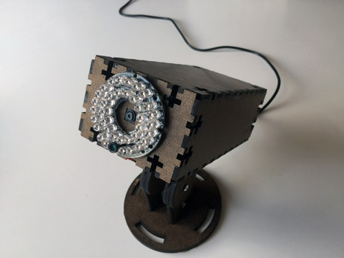
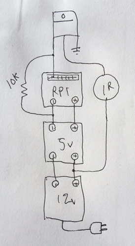

###RPi Baby Monitor (WIP)

This project is a fork of the [RPi Cam Web
Interface](https://github.com/silvanmelchior/RPi_Cam_Web_Interface). It
adds an IR LED array that allows low light operation and is controllable via web interface. Most of these parts were sponsored by [Newark / Element14](http://www.newark.com/) - thanks guys!

###BOM

Part | Cost
| :--- | ---: |
| [Raspberry Pi board](http://www.newark.com/raspberry-pi/rpi2-modb-8gb-noobs/sbc-raspberry-pi-2-model-b-8gb/dp/38Y6469?selectedCategoryId=&exaMfpn=true&categoryId=&searchRef=SearchLookAhead&iscrfnonsku=false) (tested on B2 v1.1) | $40 |
| [Noir camera board](http://www.newark.com/raspberry-pi/rpi-noir-camera-board/raspberry-pi-noir-camera-board/dp/08X2023) | $25 |
| [USB wifi dongle](http://www.newark.com/adafruit-industries/814/miniature-wifi-module-raspberry/dp/53W6285?ost=53W6285&selectedCategoryId=&categoryNameResp=All%2BCategories&iscrfnonsku=false) | $12 |
| [12v power supply](https://www.amazon.com/gp/product/B00DKSI0S8/ref=oh_aui_detailpage_o02_s00?ie=UTF8&psc=1) | $12 |
| [IR LED array](https://www.amazon.com/gp/product/B0056XFS5S/ref=oh_aui_detailpage_o05_s00?ie=UTF8&psc=1) | $4 |
| [12v to 5v buck](https://www.amazon.com/gp/product/B008BHAOQO/ref=oh_aui_detailpage_o02_s00?ie=UTF8&psc=1) | $6 |
| [N-Channel MOSFET](https://www.sparkfun.com/products/10213) (overkill) | $1 |
| 10k resistor, misc wire | $0 |
| Total | $100 |

###Installation Instructions

1. Download and install [NOOBS](https://www.raspberrypi.org/downloads/)
2. Enable [SSH](https://learn.adafruit.com/adafruits-raspberry-pi-lesson-6-using-ssh/enabling-ssh)
3. ``sudo apt-get install lsb-release``
4. ``lsb_release -a``
5. Confirm OS code name. I have only tested this code on [Jessie](https://www.raspberrypi.org/blog/raspbian-jessie-is-here/).
6. [Attach](https://www.raspberrypi.org/help/camera-module-setup/) and [test](https://www.raspberrypi.org/documentation/configuration/camera.md) camera
7. Install and test [WiringPi](https://learn.sparkfun.com/tutorials/raspberry-gpio/c-wiringpi-setup)
7. ``git clone https://github.com/TaylorHokanson/RPi_Cam_Web_Interface.git``
8. ``cd RPi_Cam_Web_Interface``
9. ``chmod u+x *.sh``
10. ``./install.sh``

###Schematic

###A Note About GPIO
Wiring RPi GPIO pins can be confusing. This code runs in BCM mode and works for the RPi model I tested. You should see [this explanation](http://raspberrypi.stackexchange.com/questions/12966/what-is-the-difference-between-board-and-bcm-for-gpio-pin-numbering) for tips on how to verify which numbering system your RPi requires. You can change the pin that controls the IR array by modifying ledon.php and ledoff.php in the www folder.

GPIO | Connect To
| :---: | :---: |
| 2 | 5V
| 6 | Ground
| 26 | MOSFET

###Housing
If you have access to a laser cutter, you'll find the housing I designed in the [media](media) folder.

###Usage
1. Enter RPi IP address into a browser and navigate to HTML the folder.
2. Toggle camera start/stop with the GUI button. Every time after the first press, this button will activate the camera and IR array for 10 seconds, then turn itself back off. This duration can be modified by changing the ``sleep()`` duration in ledoff.php.

###Next Steps
Right now my camera only gets about 1fps over wifi. I tried [these steps](http://elinux.org/RPi-Cam-Web-Interface#Network_speed_.2F_choppy_video) but had no luck. Wired Ehternet works much faster (with occassional choppiness) but is not possible in all situations. Drop me a line if you figure out a workaround!

